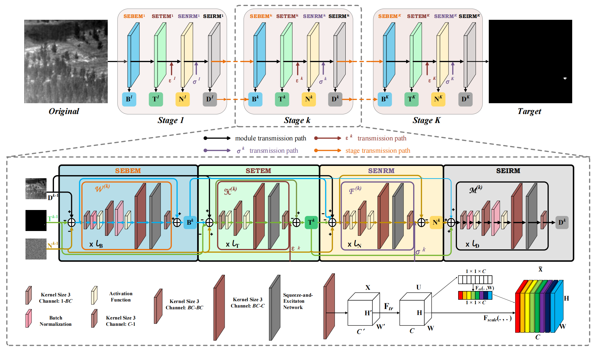

# L-RPCANet

The code in this toolbox implements "Lightweight Deep Unfolding Networks with Enhanced Robustness for Infrared Small Target Detection" by <i>J. Liu, Y. Han, L. Liu, X. Xiu, J. Zhang, W. Liu</i>.

### Testing
Directly run main.py for reproduction.

